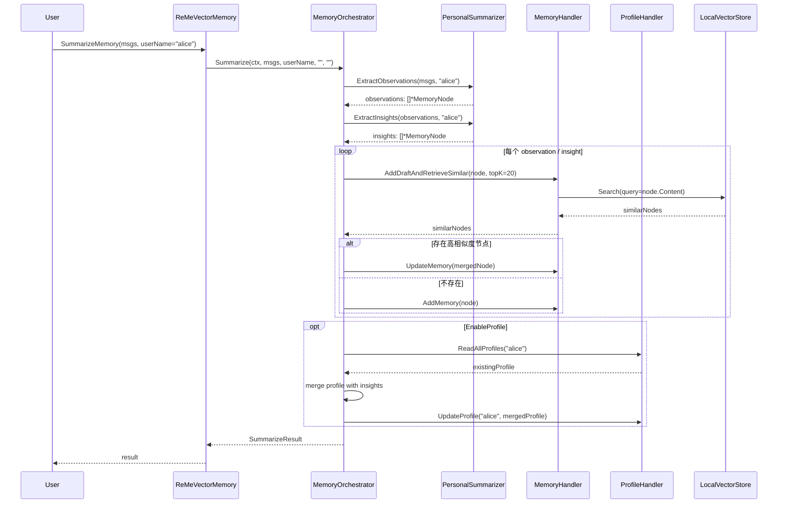
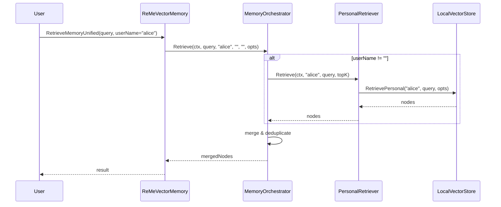

# AgentScope.Go ReMe Orchestrator 完整实施方案

> 版本：v1.0
> 目标：补齐 ReMe Python 版中最核心的「编排层（Orchestration Layer）」，让 Go 版具备端到端的记忆提取-去重-写入-检索能力。
> 路线：轻量显式编排器（非 ReAct Agent 化），兼顾功能对齐与 Go 工程简洁性。

---

## 目录

1. [设计目标与原则](#1-设计目标与原则)
2. [整体架构](#2-整体架构)
3. [核心组件设计](#3-核心组件设计)
4. [接口与类型定义](#4-接口与类型定义)
5. [数据流时序图](#5-数据流时序图)
6. [文件组织](#6-文件组织)
7. [实施计划](#7-实施计划)
8. [验收标准](#8-验收标准)

---

## 1. 设计目标与原则

### 1.1 目标
- 实现 `ReMeVectorMemory.SummarizeMemory`：输入一段对话，自动提取 Personal/Procedural/Tool 记忆，完成查重、冲突解决、写入向量库、更新 Profile。
- 实现 `ReMeVectorMemory.RetrieveMemory`：输入 query，自动分发给 Personal/Procedural/Tool 检索器，合并去重后返回。
- 补齐 `MemoryHandler`、`ProfileHandler`、`HistoryHandler` 等工具层，使 Summarizer 不再只是"纯函数"，而是能真正操作存储。
- 保持与 Python ReMe 的**功能对齐**，但采用**显式编排**而非 ReAct Agent 循环，降低复杂度。

### 1.2 原则
1. **显式优于隐式**：Orchestrator 用清晰的步骤函数而非黑盒 ReAct。
2. **组合优于继承**：Summarizer 保持纯函数，Orchestrator 负责组合它们与 Handler。
3. **向后兼容**：不破坏现有 `ReMeFileMemory`、`ReMeVectorMemory`、`Memory` 接口。
4. **可测试性**：每个 Handler 和编排步骤都有独立单元测试。
5. **渐进式**：先实现最小可用闭环（MVP），再扩展高级特性。

---

## 2. 整体架构

```
┌─────────────────────────────────────────────────────────────────────┐
│                         ReMeVectorMemory                             │
│  ┌───────────────────────────────────────────────────────────────┐  │
│  │                  MemoryOrchestrator                            │  │
│  │  ┌─────────────┐  ┌─────────────┐  ┌─────────────┐           │  │
│  │  │ Summarize() │  │ Retrieve()  │  │  MemoryTool │           │  │
│  │  └──────┬──────┘  └──────┬──────┘  └──────┬──────┘           │  │
│  │         │                │                │                  │  │
│  │  ┌──────┴──────┐  ┌──────┴──────┐  ┌──────┴──────┐          │  │
│  │  │PersonalSum  │  │PersonalRet  │  │ MemoryHandler│          │  │
│  │  │ProceduralSum│  │ProceduralRet│  │ ProfileHandler│         │  │
│  │  │ToolSum      │  │ToolRet      │  │ HistoryHandler│         │  │
│  │  └─────────────┘  └─────────────┘  └─────────────┘          │  │
│  └───────────────────────────────────────────────────────────────┘  │
│                           ▲                                         │
│              ┌────────────┴────────────┐                           │
│              │      LocalVectorStore     │                           │
│              │   (vector + filter + CRUD)│                           │
│              └───────────────────────────┘                           │
└─────────────────────────────────────────────────────────────────────┘
```

---

## 3. 核心组件设计

### 3.1 MemoryOrchestrator

主编排器，挂载在 `ReMeVectorMemory` 内部（通过配置注入）。

```go
type MemoryOrchestrator struct {
    PersonalSum    *PersonalSummarizer
    ProceduralSum  *ProceduralSummarizer
    ToolSum        *ToolSummarizer
    PersonalRet    *PersonalRetriever
    ProceduralRet  *ProceduralRetriever
    ToolRet        *ToolRetriever
    
    MemoryTool     *MemoryHandler      // 向量库 CRUD + 草稿检索
    ProfileTool    *ProfileHandler     // 本地 profile 文件
    HistoryTool    *HistoryHandler     // 历史记录读写
    
    Dedup          *MemoryDeduplicator  // 去重器（已存在，待补齐）
}
```

核心方法：
- `Summarize(ctx, msgs, userName, taskName, toolName) (*SummarizeResult, error)`
- `Retrieve(ctx, query, userName, taskName, toolName, opts) ([]*MemoryNode, error)`

### 3.2 MemoryHandler

封装向量库操作，提供 ReMe Python 中 `vector_tools/record/` 的等价能力。

```go
type MemoryHandler struct {
    Store VectorStore
}

// 方法
func (h *MemoryHandler) AddDraftAndRetrieveSimilar(ctx, node, topK int) ([]*MemoryNode, error)
func (h *MemoryHandler) AddMemory(ctx, node) error
func (h *MemoryHandler) UpdateMemory(ctx, node) error
func (h *MemoryHandler) DeleteMemory(ctx, memoryID) error
func (h *MemoryHandler) RetrieveMemory(ctx, query, opts) ([]*MemoryNode, error)
func (h *MemoryHandler) ListMemory(ctx, filters, limit, sortKey, reverse) ([]*MemoryNode, error)
```

### 3.3 ProfileHandler

管理 `working_dir/profile/<collection>/<user>.json` 的本地画像文件。

```go
type ProfileHandler struct {
    ProfileDir string
}

// 方法
func (h *ProfileHandler) ReadAllProfiles(ctx, userName string) (map[string]any, error)
func (h *ProfileHandler) UpdateProfile(ctx, userName string, profile map[string]any) error
func (h *ProfileHandler) AddProfile(ctx, userName string, profile map[string]any) error
```

### 3.4 HistoryHandler

管理历史记录节点（对应 `vector_tools/history`）。

```go
type HistoryHandler struct {
    Store VectorStore
}

// 方法
func (h *HistoryHandler) AddHistory(ctx, msgs []*message.Msg, author string) (*MemoryNode, error)
func (h *HistoryHandler) ReadHistory(ctx, memoryTarget string, limit int) ([]*MemoryNode, error)
```

### 3.5 MemoryDeduplicator（增强）

现有 `memory/deduplicator.go` 可能只有空壳，需补全：
- 基于内容相似度（Jaccard / Cosine）的去重
- 基于 LLM 的冲突检测（可选，MVP 阶段可用规则替代）

---

## 4. 接口与类型定义

### 4.1 SummarizeResult

```go
type SummarizeResult struct {
    PersonalMemories   []*MemoryNode
    ProceduralMemories []*MemoryNode
    ToolMemories       []*MemoryNode
    UpdatedProfiles    map[string]map[string]any // user -> profile
    AddedHistory       *MemoryNode
}
```

### 4.2 OrchestratorConfig

```go
type OrchestratorConfig struct {
    EnablePersonal    bool
    EnableProcedural  bool
    EnableTool        bool
    EnableProfile     bool
    EnableHistory     bool
    
    RetrieveTopK      int     // 查重时检索 topK，默认 20
    MinScore          float64 // 查重最低相似度，默认 0.1
    DeduplicateThreshold float64 // 去重阈值，默认 0.85
}
```

### 4.3 ReMeVectorMemory 增强接口

在 `ReMeVectorMemory` 上增加：

```go
func (v *ReMeVectorMemory) SummarizeMemory(
    ctx context.Context,
    msgs []*message.Msg,
    userName, taskName, toolName string,
) (*SummarizeResult, error)

func (v *ReMeVectorMemory) RetrieveMemoryUnified(
    ctx context.Context,
    query string,
    userName, taskName, toolName string,
    opts RetrieveOptions,
) ([]*MemoryNode, error)
```

---

## 5. 数据流时序图

### 5.1 SummarizeMemory 流程（以 Personal 为例）



### 5.2 RetrieveMemoryUnified 流程



---

## 6. 文件组织

```
agentscope.go/memory/
├── orchestrator.go              # MemoryOrchestrator 核心编排器
├── orchestrator_test.go         # 编排器单元测试
├── handler/
│   ├── memory_handler.go        # MemoryHandler（向量库封装）
│   ├── memory_handler_test.go
│   ├── profile_handler.go       # ProfileHandler（本地画像）
│   ├── profile_handler_test.go
│   ├── history_handler.go       # HistoryHandler（历史记录）
│   └── history_handler_test.go
├── deduplicator.go              # 增强：内容去重 + 冲突解决
├── deduplicator_test.go
├── reme_vector_memory.go        # 增强：挂载 Orchestrator
├── reme_file_memory.go          # 增强：异步摘要任务支持（goroutine）
└── reme_types.go                # 增加 SummarizeResult 等类型

agentscope.go/examples/reme/
├── orchestrator/                # 新增示例
│   └── main.go                  # 端到端 Summarize + Retrieve 演示
```

---

## 7. 实施计划

### Step 1：补齐 Handler 层（MVP 基础）
- [ ] 实现 `MemoryHandler`（CRUD + 草稿检索）
- [ ] 实现 `ProfileHandler`（本地 JSON 文件读写）
- [ ] 实现 `HistoryHandler`（历史记录节点）
- [ ] 补全 `MemoryDeduplicator`
- [ ] 每个 Handler 都附带 `_test.go`

### Step 2：构建 MemoryOrchestrator（核心）
- [ ] 定义 `MemoryOrchestrator` 结构体与配置
- [ ] 实现 `Summarize` 方法（Personal/Procedural/Tool 分支）
- [ ] 实现 `Retrieve` 方法（统一入口，分类型检索）
- [ ] 集成去重与冲突解决逻辑
- [ ] 编写 `orchestrator_test.go`

### Step 3：挂载到 ReMeVectorMemory
- [ ] `ReMeVectorMemory` 增加 `Orchestrator` 字段
- [ ] 实现 `SummarizeMemory` 与 `RetrieveMemoryUnified` 公开方法
- [ ] 提供 `WithOrchestrator` 构造选项或初始化函数
- [ ] 编写 `reme_integration_test.go` 的编排相关测试

### Step 4：增强 FileMemory（异步摘要）
- [ ] `ReMeFileMemory` 增加异步 `SummarizeToDailyFile` goroutine 池
- [ ] 实现 `AddAsyncSummaryTask` 与 `AwaitSummaryTasks`
- [ ] 在 `PreReasoningPrepare` 压缩后触发异步摘要

### Step 5：示例与文档
- [ ] `examples/reme/orchestrator/main.go`：完整演示
- [ ] 更新 `REME_CHECKLIST.md` 与 `TEST_COVERAGE.md`
- [ ] 确保 `go test ./...` 全绿

---

## 8. 验收标准

- [ ] `go test ./memory/...` 全绿，新增测试覆盖率 > 70%
- [ ] `ReMeVectorMemory.SummarizeMemory` 能完成端到端记忆提取与写入
- [ ] `ReMeVectorMemory.RetrieveMemoryUnified` 能按类型检索并合并结果
- [ ] `ProfileHandler` 能正确读写 `profile/<user>.json`
- [ ] `ReMeFileMemory` 在压缩后能异步写 `memory/YYYY-MM-DD.md`
- [ ] 新增 `examples/reme/orchestrator` 可编译运行
- [ ] 不破坏现有 `InMemoryMemory`、`WindowMemory`、`ReMeFileMemory` 接口

---

*本方案一经确认，即刻进入 Step-by-Step 实施阶段。*
